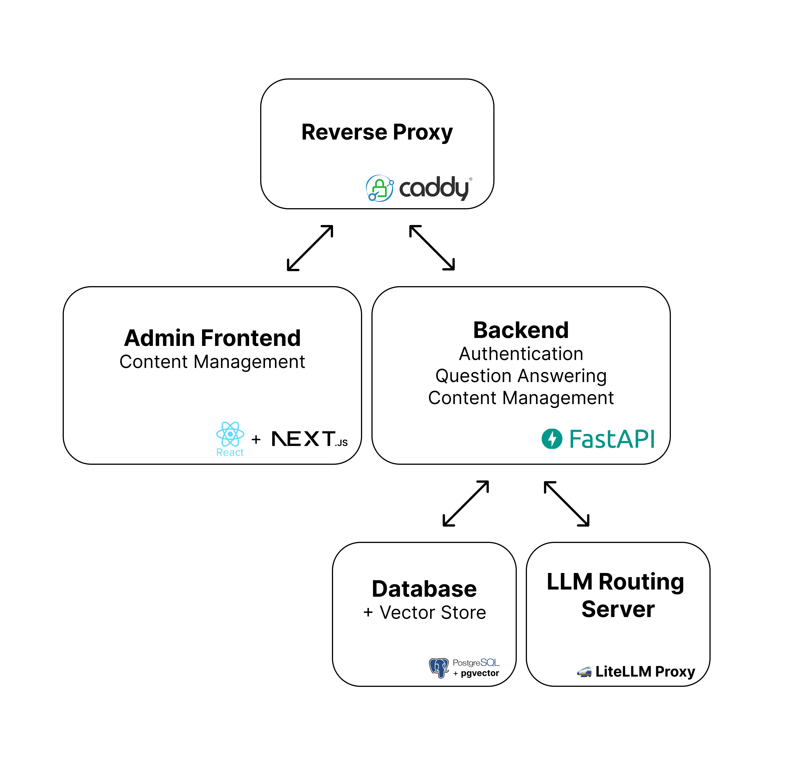

<p align="center">


</p>

<p align="center" style="text-align:center">
<a href="https://docs.ask-a-question.com/">Developer Docs</a> |
<a href="#features">Features</a> |
<a href="#usage">Usage</a> |
<a href="#architecture">Architecture</a> |
<a href="#funders-and-partners">Funders and Partners</a>
</p>

**[Ask A Question](https://ask-a-question.com/)** is a free and open-source tool created to help non-profit organizations, governments in developing nations, and social sector organizations use **Large Language Models** for responding to citizen inquiries in their **native languages**.

## :woman_cartwheeling: Features

#### **:question: LLM-powered search**

Match your questions to content in the database using embeddings from LLMs.

#### **:robot: LLM responses**

Craft a custom reponse to the question using LLM chat and the content in your database

#### **:electric_plug: Integrate with your own chatbot**

Connect to your own chatbot on platforms like [Turn.io](https://www.turn.io/), [Glific](https://glific.org/), and [Typebot](https://typebot.io/) using our APIs.

#### **:books: Manage content**

Use the AAQ App to add, edit, and delete content in the database (Sign up for a demo [here](https://app.ask-a-question.com))

#### :rotating_light: Message Triaging

Identify urgent or important messages based on your own criteria.

#### :office_worker: Content manager dashboard

See which content is the most sought after, the kinds of questions that receive poor feedback, identify missing content, and more

## :construction: Upcoming

#### **:speech_balloon: Conversation capability**

Refine or clarify your question through conversation

#### :video_camera: Multimedia content

Respond with not just text but voice, images, and videos as well.

#### :technologist: Engineering dashboard

Monitor uptime, response rates, throughput HTTP reponse codes and more

> [!NOTE]
> Looking for other features? Please raise an issue with `[FEATURE REQUEST]` before the title.

## Usage

To get answers from your database of contents, you can use the `/search` endpoint. This endpoint returns the following:

- Search results: Finds the most similar content in the database using cosine distance between embeddings.
- (Optionally) LLM generated response: Crafts a custom response using LLM chat using the most similar content.

See [docs](https://docs.ask-a-question.com/) or [API docs](https://app.ask-a-question.com/api/docs) for more details and other API endpoints.

### :question: Simple content search

```shell
curl -X 'POST' \
  'https://[DOMAIN]/api/search' \
  -H 'accept: application/json' \
  -H 'Authorization: Bearer <BEARER TOKEN>' \
  -H 'Content-Type: application/json' \
  -d '{
  "query_text": "how are you?",
  "generate_llm_response": false,
  "query_metadata": {}
}'
```

### :robot: With LLM response

The query looks the same as above, except `generate_llm_response` is set to `true`:

```shell
curl -X 'POST' \
  'https://[DOMAIN]/api/search' \
  -H 'accept: application/json' \
  -H 'Authorization: Bearer <BEARER TOKEN>' \
  -H 'Content-Type: application/json' \
  -d '{
  "query_text": "this is my question",
  "generate_llm_response": true,
  "query_metadata": {}
}'
```

### :books: Manage content

You can access the admin console at

```
https://[DOMAIN]/
```

## Architecture

We use docker-compose to orchestrate containers with a reverse proxy that manages all incoming traffic to the service. The database and LiteLLM proxy are only accessed by the core app.

<p align="center">
  
</p>

## Documentation

See [here](https://docs.ask-a-question.com/) for full documentation.

## Funders and Partners


