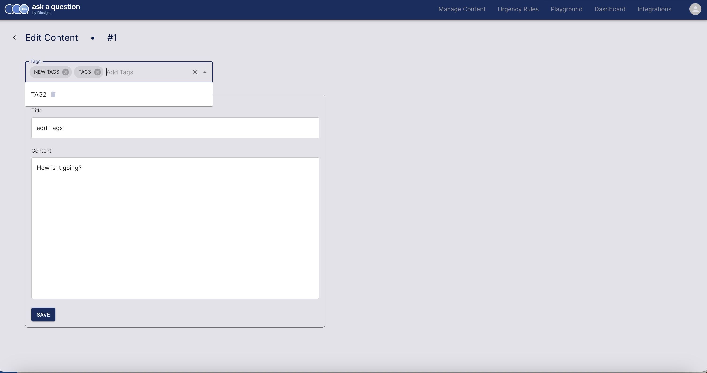

---
authors:
  - Carlos
category:
  - Admin App
  - Api
date: 2024-06-17
---

# New feature detected: Tags

Filtering contents has been made easier with tags.

<!-- more -->

## Manage tags

On the Admin App, it is now possible to add tags to contents to categorise them. You can create a tag, add it the content and delete it directly within the edit content page. We also added the possibility of filtering contents using tags for a seemless content management experience.

The bar shown on the image below will allow to quickly manage tags.

On the landing page, you can use the bar shown below to filter contents based on tags.

{: .blog-img }
