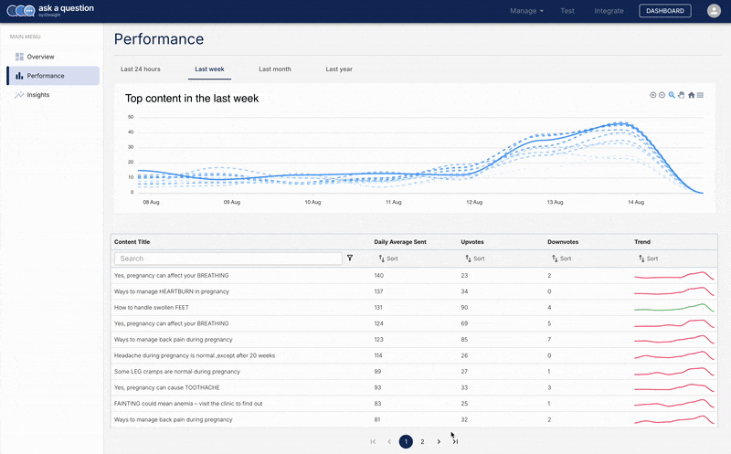

---
authors:
  - Sid
category:
  - Admin App
  - Dashboard
date: 2024-08-14
---

# A new AI-powered dashboard page

[Last month](./dashboard-overview-page.md) we rolled out the "Overview" page of the dashboard.
Today, we are excited to share the "Performance" page. This includes a detailed view of
the performance of your content, and AI-powered suggestions on how to improve it.

<!-- more -->

Here's it is in action

{: .blog-img }

## Why did we build this?

In a world with too many "set-it-and-forget-it" RAG solutions, we decided to build a solution
that is designed to be continuously improved. We believe that a quality service requires
deep engagement with the users and their feedback.

The "Performance" page allows for just that. It lets you see which contents are being
shared, and the feedback each is receiving. Using AI, we are able to
summarize user feedback and suggest ways to improve the content.

As before, a special thanks to Anh Mac from Google for the UI/UX design.

## Doc references

- [Dashboard](../../components/admin-app/dashboard/index.md)
