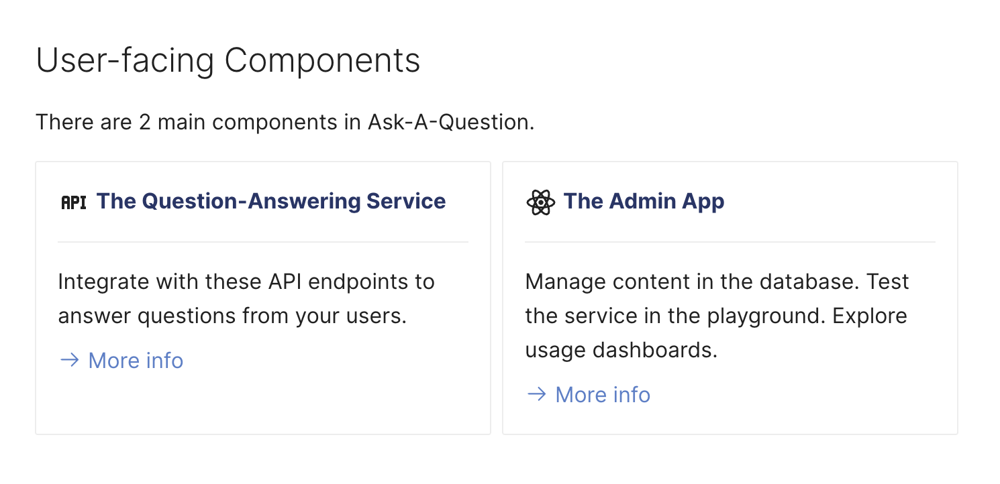

---
authors:
  - Sid
category:
  - AI Safety
  - LLM Response
  - API
date: 2024-01-12
---

# Improved docs!

First, we have added this section that you are currently reading. Each week we'll post
what we've rolled out - new features, bug fixes, and performance improvements.

The rest of the docs have now also been restructured to make it easy to parse.

<!-- more -->

## Now with cards!

A lot of the index pages now show cards like the one shown below. These should
make it easy to grasp the content in section in a glance.

{: .blog-img }

## Process Flow Diagrams

[Search](../../components/qa-service/search.md) page now shows process flow diagrams.
It should make it a lot easier to understand what is happening under the hood when
you call either of these endopints.

{: .blog-img }
