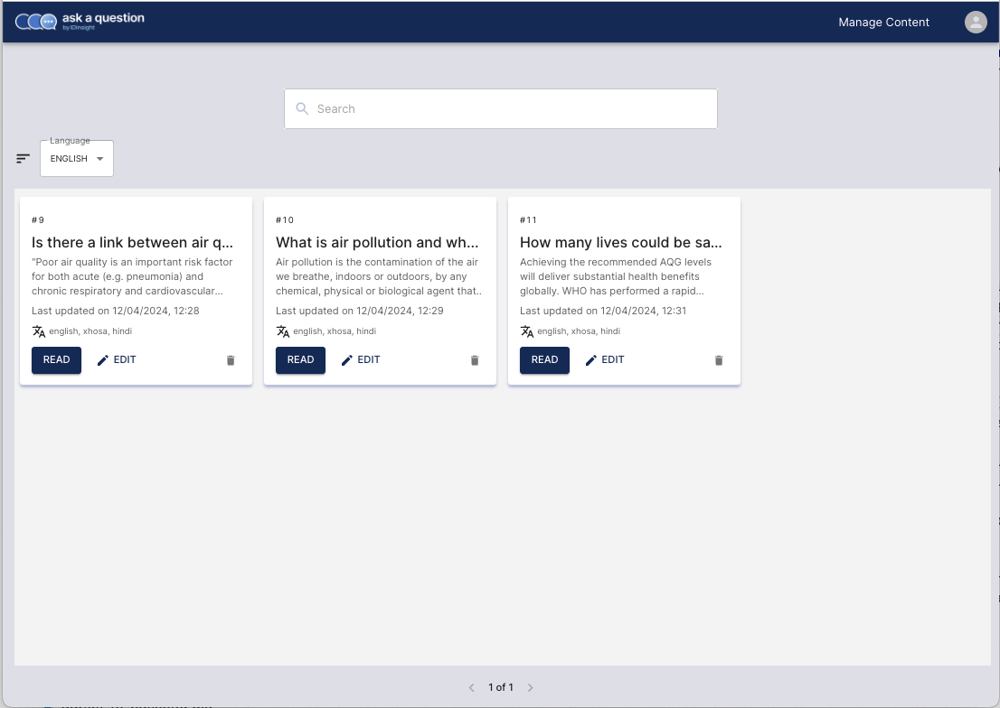
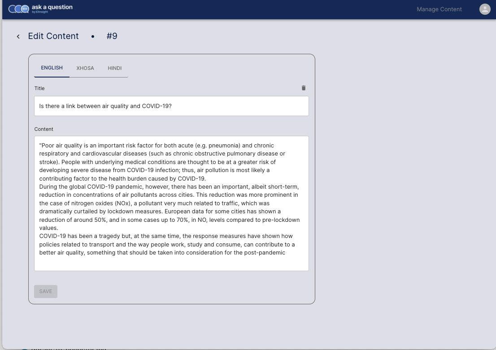

---
authors:
  - Carlos
category:
  - Database
  - API
date: 2024-04-19
---
# Namaste Multilingual support

We are excited to announce a significant enhancement to our web application: _multilingual content management_. This update sets stone to one of our key features which is to enable multlilingual model support. This update will make managing contents in different languages easier.
We are excited to announce a significant enhancement to our web application: _multilingual content management_. You can now add different language versions for each of your content pieces.
<!-- more -->

## What's new?

Multilingual content support changes the way contents are managed. Now contents can have many languages version, up to the number of languages supported. Allowing contents to have different language versions will help enhancing the accessibility of contents by breaking the language barrier. Users will be able to ask questions in their local language and receive answers in the same language, improving user experience. Here is the new look of our projet's Admin App.

| Old UI                                                                | Multilingual UI                                                                |
| --------------------------------------------------------------------- | ------------------------------------------------------------------ |
| Main page                                                             |
|  |  |
| Edit page                                                             |
|  |  |

## What's next ?

The next steps will be to add models to support different low-resource languages, our priority being Hindi, Zulu and Xhosa.
