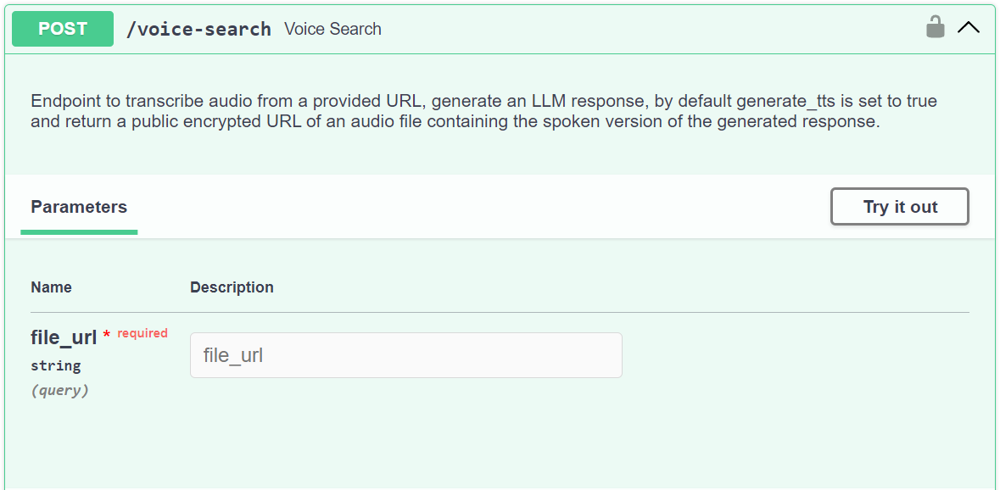

---
authors:
  - Mustafa
category:
  - API
  - Components
date: 2024-09-09
---

# From Thought to Speech: Introducing AAQ's New Voice Service

We're excited to unveil our new **End-to-End Speech Service** for AAQ! This powerful component allows you to seamlessly ask your questions on your device and recieve a spoken response back. Powered by advanced AI it integrates Text-to-Speech and Speech-to-Text capabilities, allowing you to easily create dynamic voice experiences through AAQ.

<!-- more -->

Take a look at it it in action, integrating with a typical WhatsApp chat via the [Typebot](https://typebot.io/) chatflow manager:

{: .blog-img }
<p style="text-align:center"><em>A demonstration using the E2E speech pipeline to ask AAQ "What should I eat during pregnancy?"<em></p>

## **Why did we build this?**

As voice-driven interactions become the norm for providing accessibility and ease of use, we recognized the need to extend beyond text-based solutions.

In many developing countries, voice communication is often preferred over text for a variety of reasons. Voice is inherently more intuitive, making it accessible to individuals with limited exposure to technology. Additionally, in regions with lower literacy rates, relying on text-based interactions can present barriers. By focusing on voice, we provide a solution that feels natural, immediate, and inclusive.

Our in-house Speech Service uses cutting-edge AI models, enabling real-time speech synthesis and transcription with remarkable accuracy across multiple languages, giving users a seamless and consistent voice experience.

## **How It Works: The `/voice-search` Endpoint**

At the heart of AAQ's speech capabilities lies the `/voice-search` endpoint. This powerful API is the gateway to accessing our Speech Service. Here's a glimpse into how it operates:

{: .blog-img }

The `/voice-search` endpoint expects a URL of a voice file stored in any public cloud storage. It processes this audio input and returns a structured response, enabling enabling hassle-free integration of voice interactions into your applications.

Here's an example of the response model returned by the endpoint:

```json
{
    "query_id": 1,
    "llm_response": "Example LLM response ",
    "search_results": {
        "0": {
            "title": "Example content title",
            "text": "Example content text",
            "id": 23,
            "distance": 0.1,
        },
        "1": {
            "title": "Another example content title",
            "text": "Another example content text",
            "id": 12,
            "distance": 0.2,
        },
    },
    "feedback_secret_key": "secret-key-12345-abcde",
    "debug_info": {"example": "debug-info"},
    "tts_filepath": "https://storage.googleapis.com/example-bucket/random_uuid_filename.mp3"
}
```

This straightforward yet powerful interface allows developers to easily incorporate voice search capabilities into their AAQ-powered applications, opening up a world of possibilities for voice-driven interactions.

## **Future Enhancements**

We're committed to continuously improving our Speech Service. Here are some exciting changes on our roadmap:

1. **<u>Faster Inference Times:</u>** We're working on optimizing our AI models and infrastructure to reduce latency and provide even quicker responses.
2. **<u>Expanded Language Support:</u>** We aim to serve underrepresented languages, enhancing accessibility for global users by significantly increasing our language offerings.
3. **<u>Enhanced Customization Options:</u>** We aim to introduce more customization features, allowing users to fine-tune voice characteristics like accent, speed, and emotion to better suit their specific use cases.

Stay tuned for these updates as we strive to make our Speech Service even more powerful and user-friendly!

## **Docs references**

- [Voice Service](../../components/voice-service/index.md)
