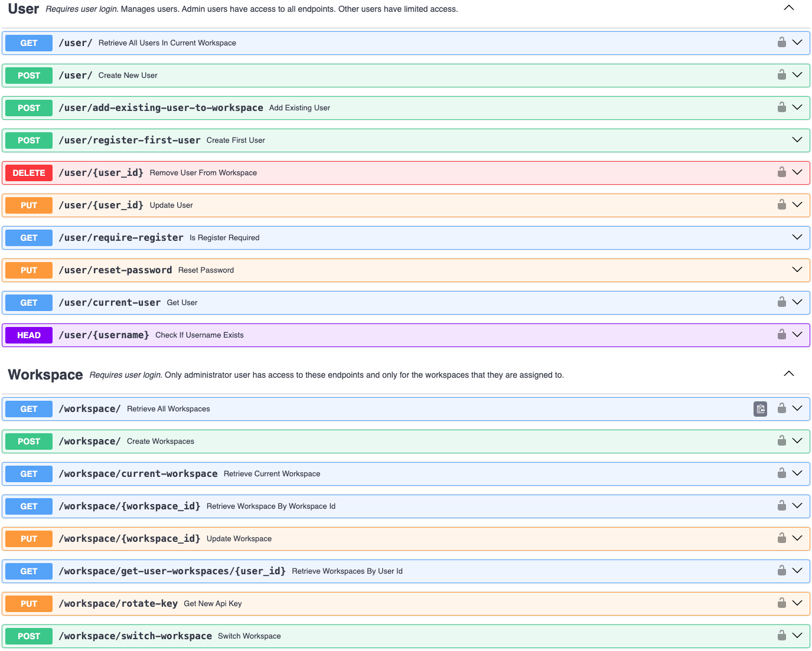

---
authors:
  - Tony
category:
  - Admin App
  - Workspaces
date: 2025-02-27
---

# Introducing Workspaces

Need a better way to organize your projects, data, and user roles?
Meet **Workspaces**—isolated virtual environments designed to simplify access management across multiple projects or teams. With the Workspaces feature, you get a cleaner, more secure, and more flexible approach to data sharing.

<!-- more -->

{: .blog-img }

## Why Workspaces?

Previously, every user was a de facto admin with unlimited read/write privileges in their environment. To share data with someone else, you had to reveal your personal credentials, granting them the same authority you had. This setup made it hard to manage sensitive data and user permissions effectively.

## The Workspace Approach

Workspaces completely overhaul this system:

1. **Isolated Virtual Environments**
   Each workspace contains its own set of content, quotas, and users, meaning no accidental overlaps or data spills.

2. **Many-to-Many Relationship**
   Users can belong to multiple workspaces, and each workspace can have multiple users. Permissions are specific to each workspace.

3. **Role-based Access**
   There are two main user types out of the box:

   - **Admin**: Full access to create, read, update, and delete data in their assigned workspace(s). They can add or remove users (including other admins), plus create new workspaces or remove their own.
   - **Read-Only**: Can only read existing data in their assigned workspace(s). They can create new workspaces but cannot modify data or user assignments within their current workspace(s).

To learn more about this new feature visit the [Workspaces Overview page](../../components/workspaces/index.md)

## Doc References

- [Workspaces Overview](../../components/workspaces/index.md)
