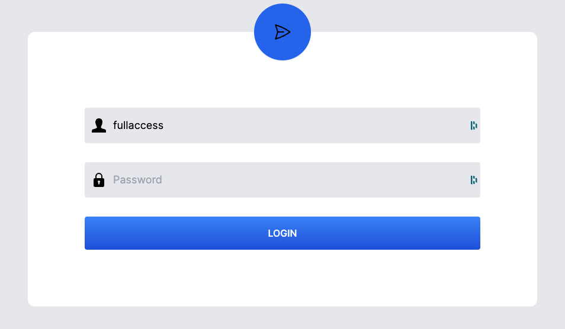

# Access levels

There are two accounts available with different levels of access:

| Account      | Read               | Edit               | Add                | Delete             | List               |
| ------------ | ------------------ | ------------------ | ------------------ | ------------------ | ------------------ |
| `readonly`   | :white_check_mark: | :x:                | :x:                | :x:                | :white_check_mark: |
| `fullaccess` | :white_check_mark: | :white_check_mark: | :white_check_mark: | :white_check_mark: | :white_check_mark: |

Both account have access to the __Playground__, __Content Manager's Dashboard__, and the
__Engineer's Dashboard__

## Setting the password

You can set the password in the
[backend config files](http://localhost:8001/aaq-core/deployment/config-options/).

## Upcoming features

- [ ] Finer access controls
- [ ] Individual user logins
- [ ] Google OAuth
