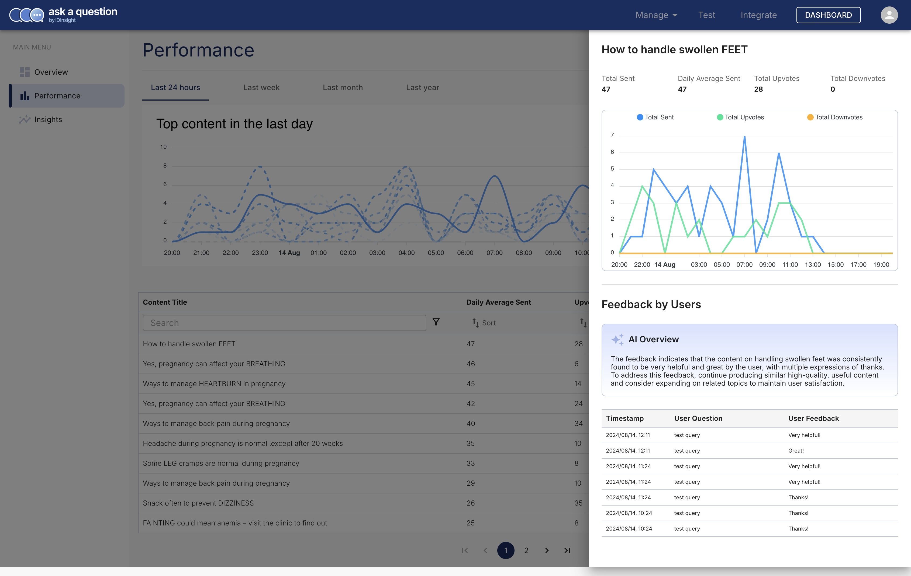

# Dashboard

The __Dashboard__ provided real-time analytics on the performance of your solution. There
are four time filters available: __Last 24 hours__, __Last week__, __Last month__, and __Last year__.

The dashboard is divided into three sections: __Overview__, __Performance__, and __Insights__.

## Overview

This landing page of the dashboard provides a high-level summary of the performance of your solution.

## Performance

This section show how well your content is performing. You can sort the content by
the number of times it was shared with your users, upvotes or downvotes, and even the
trend (is it getting more or less popular).

Clicking on the any of the content in the table opens a detailed view of the content's performance.
This also provides an AI generated summary of the feedback users have provided and
suggestion on how to improve the content.

## Insights

:construction: Stay tuned for the "Insights" section.

## Want to see more?

Is there a metric or a feature you'd like to see on the dashboard? We'd love to
hear from you. [Contact us](../../contact_us.md/)!
