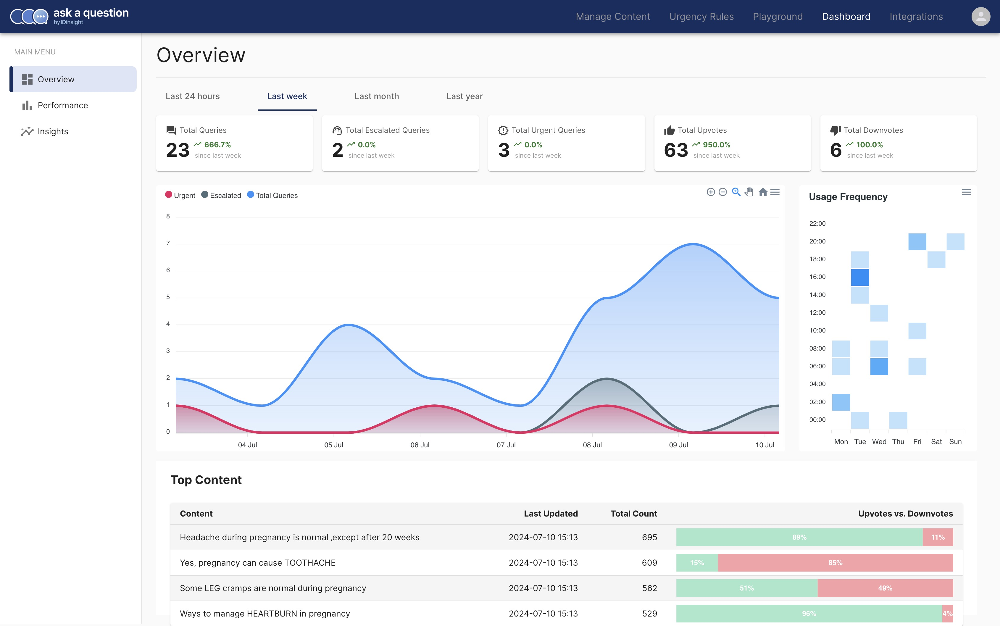
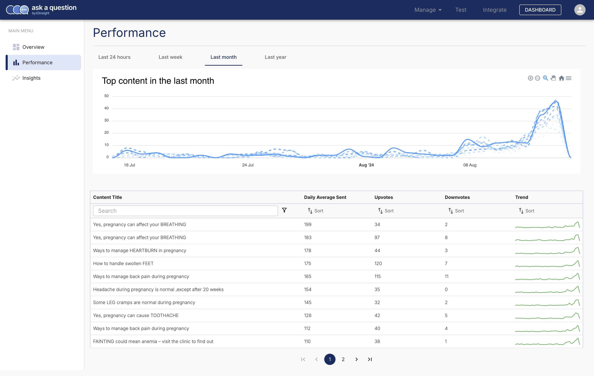
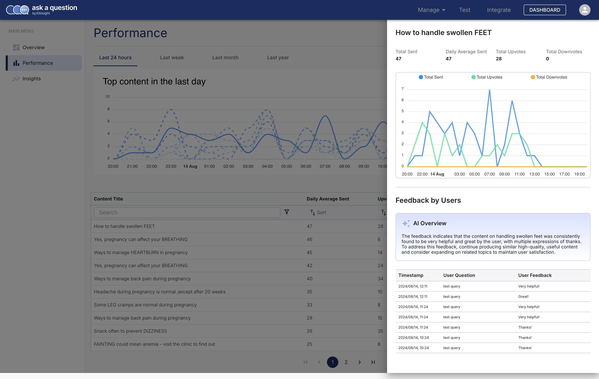

# Dashboard

The Dashboard provides real-time analytics on the performance of your solution. There
are four time filters available: _Last 24 hours_, _Last week_, _Last month_, and _Last year_.

The dashboard is divided into three sections: [Overview](#overview), [Performance](#performance), and [Content Gaps](#insights).

## Overview

This landing page of the dashboard provides a high-level summary of the performance of your solution.

## Performance

This section show how well your content is performing. You can sort the content by
the number of times it was shared with your users, upvotes or downvotes, and even the
trend (is it getting more or less popular).

Clicking on the any of the content in the table opens a detailed view of the content's performance.
This also provides an AI generated summary of the feedback users have provided and
suggestion on how to improve the content.

## Content Gaps

:construction: Stay tuned for the "Content Gaps" section.

## Want to see more?

Is there a metric or a feature you'd like to see on the dashboard? We'd love to
hear from you. [Contact us](../../contact_us.md/)!
