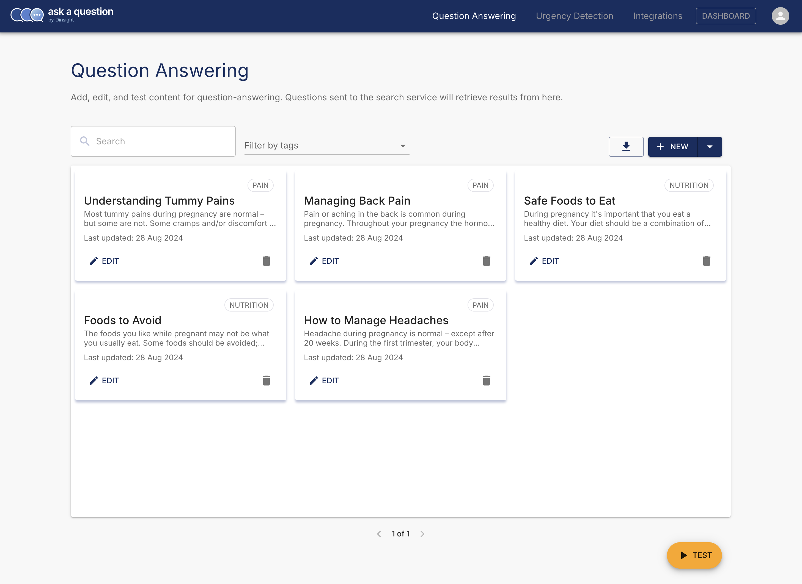
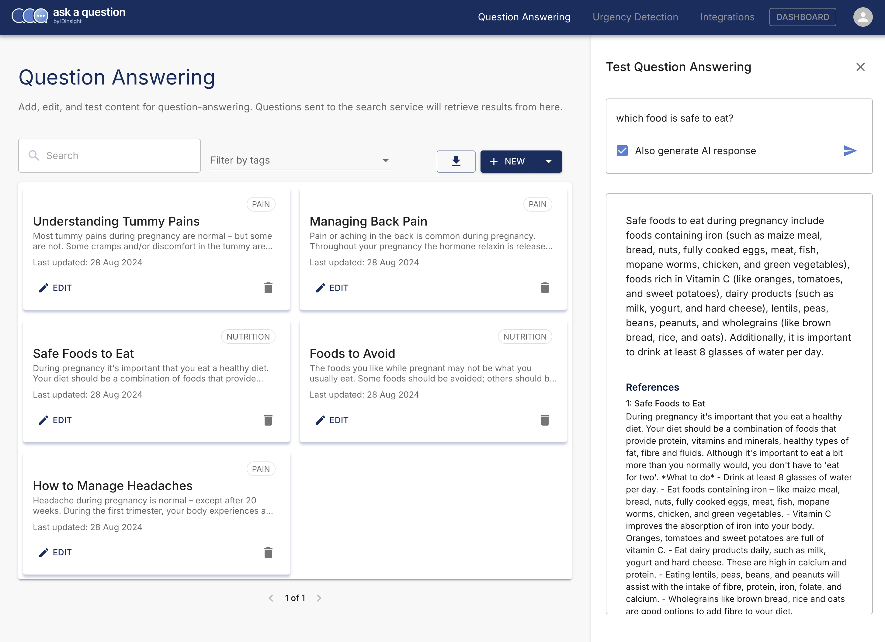

# Managing Content used for Question Answering

The Admin app allows you to view, add, edit, or delete content in the database. It also allows you to test the service
with questions to ensure the correct responses are fetched before releasing the service to your users.

Once logged in, you should see the following screen:

When you click the "Test" button, you can use the sidebar to try your questions.

## Upcoming features

- [ ] Add multiple languages for each content
- [ ] Allow metadata to be captured for each content
