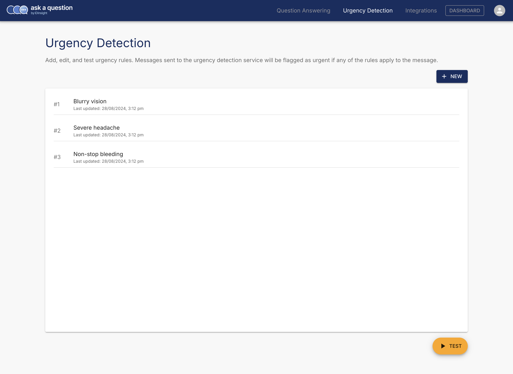
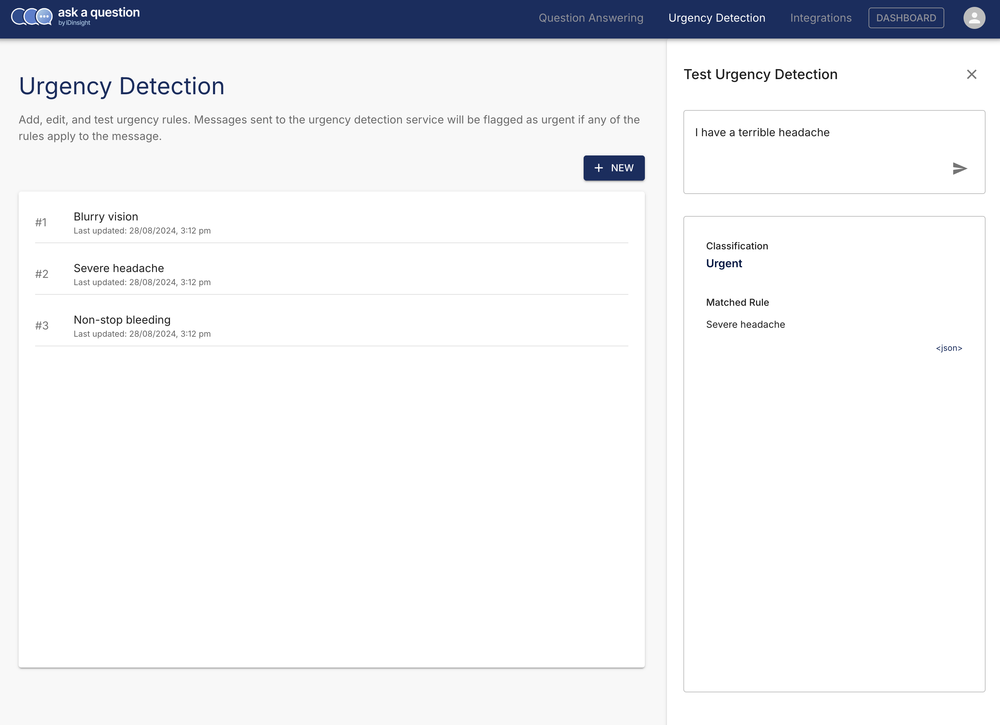

# Managing Urgency Rules

The Admin app allows you to view, add, edit, or delete  in the database. It also allows you to test the service
with messages to ensure the classifications seem correct.

Once logged in, navigate to "Urgency Detection" from the menu and you should see the
following screen

You can add, edit, delete, or test urgency rules from this screen.

When you click the "Test" button, you can use the sidebar to try your messages.

