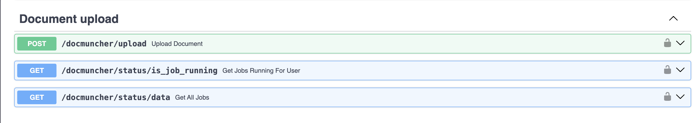
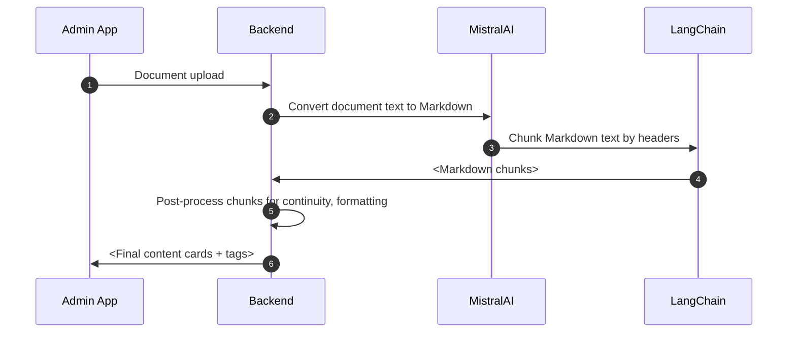

# Document Ingestion aka DocMuncher

`/docmuncher` is the endpoint that allows document uploads. We then chunk each uploaded document to create content cards tagged with each document name.
This content is then searchable using the `/search` endpoints.

There are specifically two endpoints: the `POST` endpoint accepts document uploads (.pdf or .zip) and creates FastAPI background tasks for each document uploaded. The `GET` endpoints return the status of the created jobs.

## Process flow for document ingestion

## Upcoming

- [ ] Semantiic clustering: cluster cards with similar content
- [ ] Paraphrasing cards for brevity
