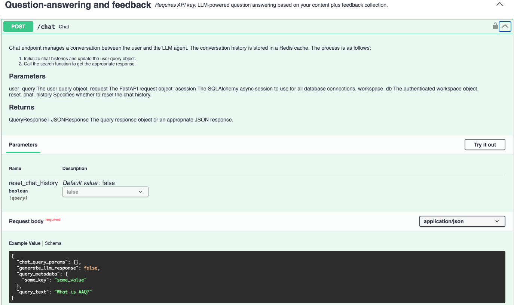

# Multi-turn Chat

The multi-turn chat endpoint, `/chat`, allows you to engage in multi-turn conversations
with your data. This endpoint manages your chat session, including the context of the
conversation and the history of questions and answers, and integrates directly with the
`/search` endpoint to provide *contextualized* answers to your questions. An API key
is required for this endpoint since an LLM is used to generate contextualized responses
based on the conversation history.

## Overview

Multi-turn conversations allow users to continue their dialogue with the LLM agent and
receive responses that are contextualized on the conversation history. Each
conversation is referenced by a unique `session_id` and consists of user messages and
appropriate LLM responses. We use Redis, an in-memory data store, to retrieve and
update the conversation history for a given session each time the `/chat` endpoint is
invoked.

### Multi-turn Conversation Procedure

1. Users send their question to the `/chat` endpoint. If the request does not include a
session ID, then a random session ID will be generated for the chat session. This
unique ID is tied to the user for the duration of the conversation session.
2. The `session_id` is used to initialize the chat history as follows:
    3. If the session exists in Redis, then the existing conversation history is
   retrieved and the new message from the user is appended to the conversation.
    4. If the session does not exist, then a new conversation history is started. The
      new conversation will have a default system message that serves as a guideline
      for the LLM behavior during the chat process (detailed below) and the first user
      message. **Thus, existing conversation histories will also have the same default
      system message as a guideline.**
5. At a minimum, all conversation histories will include a default system message and
at least one user message. In general, conversation histories will include the default
system message and the interleaved messages and responses between the user and the LLM
agent.
6. The default system message instructs the LLM to generate a query to retrieve
information from a vector database that contains information that can be used to answer
the user’s question/concern. In addition, the LLM is also instructed to determine the
Type of Message as follows:
    7. Follow-up Message: These are messages that build upon the conversation so far
      and/or seeks more clarifying information on a previously discussed
      question/concern.
    8. New Message: These are messages that introduces a new topic that was not
      previously discussed in the conversation.
9. Based on the Type of Message, the LLM then generates a suitable query to execute
against the vector database in order to retrieve relevant information that can answer
the user’s question/concern.
    10. Upon receiving the information from the vector database, we can either present
       the information as is (with optional re-ranking) or use the LLM to choose the
       top N most relevant pieces of information and perform abstractive/extractive
       summarization.
11. The final response from the LLM is presented to the user and the conversation
history is updated in Redis for the next invocation of the /chat endpoint.

### How Multi-turn Conversations are Managed

1. **Initialize the Redis client**: A Redis client is initialized and is used to cache
the conversation history for each session.
2. **Initialize the conversation history**: The conversation history can be explicitly
initialized each time the /chat endpoint is invoked. The Redis client and the
`session_id` is required to initialize the conversation history. We can also reset the
conversation history before continuing the conversation.
3. **Initialize the chat parameters for the session**: Text generation parameters for
the LLM model responsible for managing the multi-turn chat session are initialized.
4. **Start/continue the conversation**: The user then proceeds to start a new
conversation or continue the conversation from a previous session. With each turn, the
conversation history is updated in Redis and the latest response is sent back to the
user.
