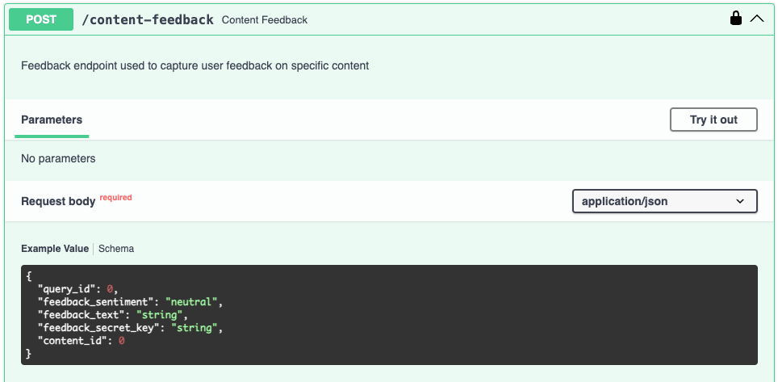

# Content Feedback

This service allows you to provide feedback for individual content items in the database.
The feedback can be used to improve the quality of the content and the search results.

See OpenAPI specification or [SwaggerUI](index.md/#swaggerui) for more details on how to call the service.
