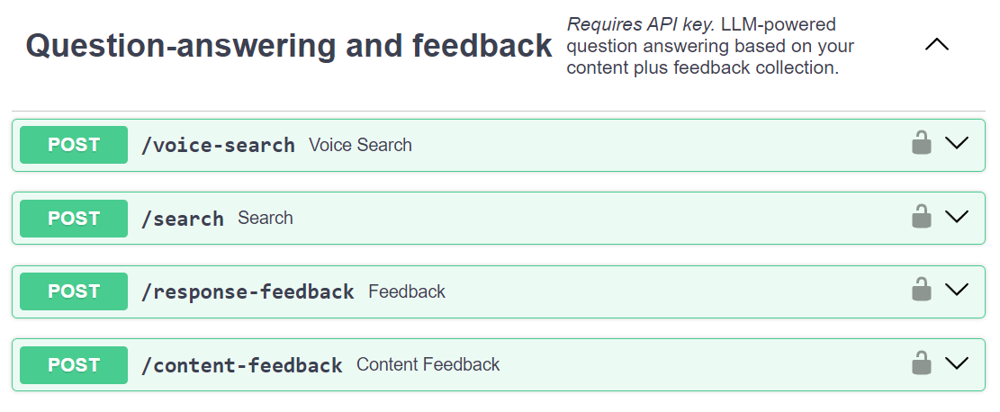

# Question-Answering Service

`/search` is the flagship endpoint that your application can integrate with:

- :material-api:{ .lg .middle } __Search__

    ---

    Allows searching through the content database using embeddings similarity and
    optionally creates an LLM-generated answer to the user's question.

    [:octicons-arrow-right-24: More info](./search.md)

`/Voice-search` is the **Optional** End to End Speech endpoint that your application can integrate with:

- :material-api:{ .lg .middle } __Voice-Search__

    ---

    Enables voice-based searching by accepting an audio file URL.
    Supports both in-house and Cloud based Solutions for transcription and Speech Synthesis.
    Returns an LLM-generated response as both text and an audio file URL.

    [:octicons-arrow-right-24: More info](./voice-search.md)

## Capturing Feedback

The service also provides two endpoint to capture feedback from users. One to capture
feedback for the response returned and the other for the content items retrieved.

For both of these, you can provide feedback as sentiment ("positive", "negative"),
as text, or as both.

- :material-api:{ .lg .middle } __Response Feedback__

    ---

    Allows users to provide feedback on the response generated by the either Semantic Search or LLM Response.

    [:octicons-arrow-right-24: More info](./response-feedback.md)

- :material-api:{ .lg .middle } __Content Feedback__

    ---

    Allows users to provide feedback on the content items returned by the Semantic Search.

    [:octicons-arrow-right-24: More info](./content-feedback.md)

## SwaggerUI

If you have the [application running](../../deployment/quick-setup.md), you can access
the SwaggerUI at

    https://[DOMAIN]/api/docs

or if you are using the [dev](../../develop/setup.md) setup:

    http://localhost:8000/docs

## Upcoming

- [ ] Chat capability
