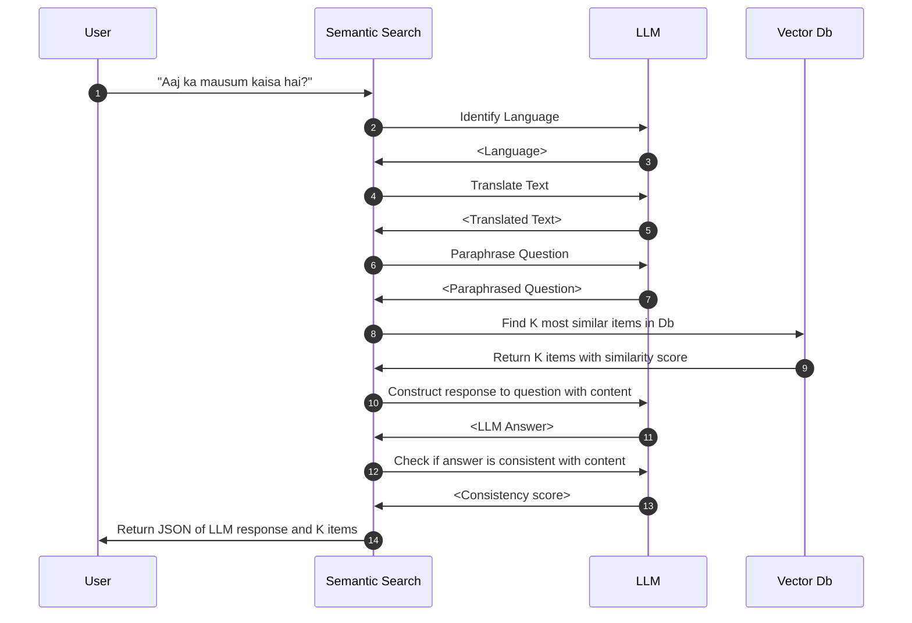
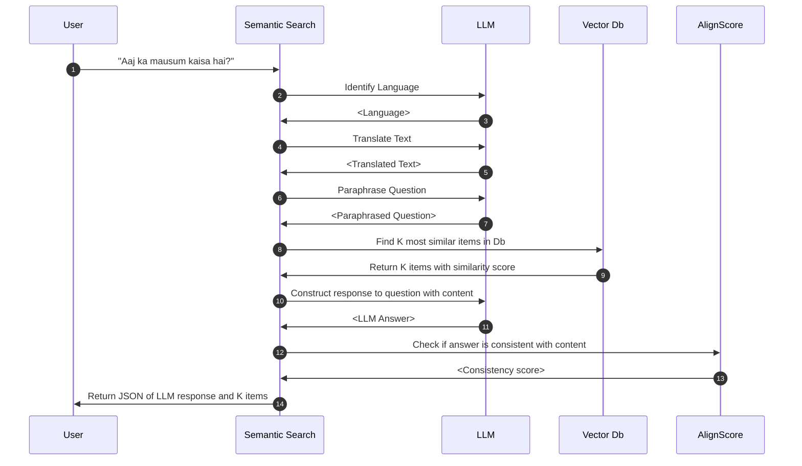

# LLM Response

This service returns uses most similar content in the database to construct a
custom answer for the user.

See OpenAPI specification or SwaggerUI for more details on how to call the service.

## Process flow

## Optional components

### Align Score

In the Process Flow above, _Step 12: Check if answer is consistent with content_ can
be done using [AlignScore](https://github.com/yuh-zha/AlignScore).

#### Enable Align Score

To enable using AlignScore for checking content consistency, set `ALIGN_SCORE_METHOD`
config variable to `AlignScore`. See [Configuring AAQ](../../deployment/config-options.md)
for ways to set this.

#### Setup infrastructure

To use AlignScore, AAQ needs access to the AlignScore service. This can be deployed
using a docker container. See [AlignScore](../../other-components/align-score/index.md) under
__Other Components__ for how to do this.
