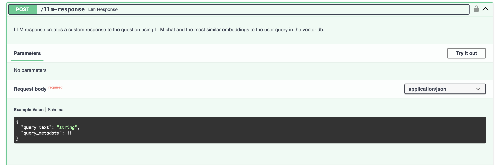
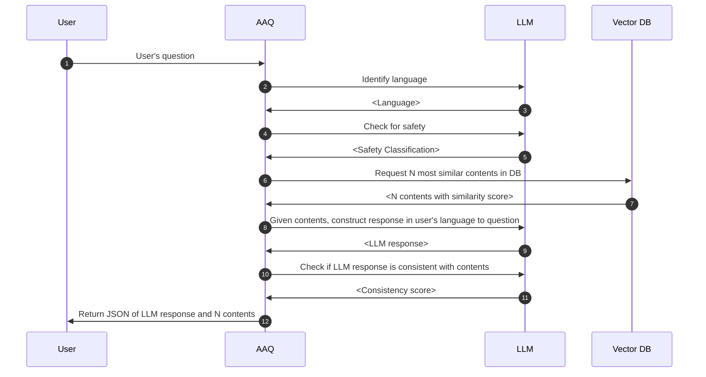
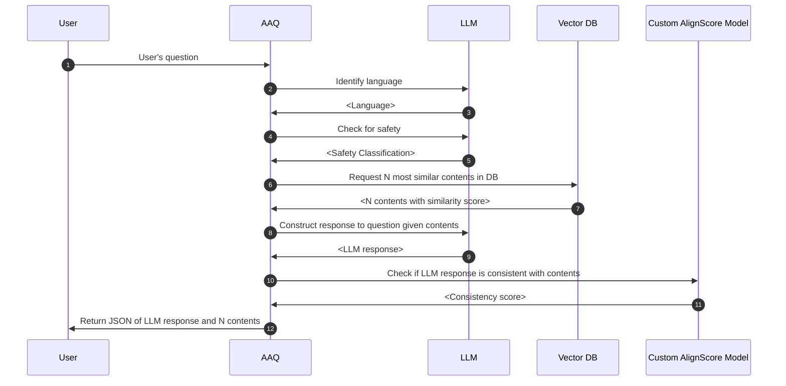

# LLM Response

This service uses most similar content in the database to construct a
custom answer for the user.

See OpenAPI specification or [SwaggerUI](index.md/#swaggerui) for more details on how to call the service.

## Process flow

## Optional components

### Align Score

In the Process Flow above, _Step 12: Check if answer is consistent with content_ can
be done using a custom [AlignScore](https://github.com/yuh-zha/AlignScore) model instead
of another LLM call.

To use the custom AlignScore model, AAQ needs access to the AlignScore service. See
[documentation](../../components/align-score/index.md) for how to setup
the service and configure AAQ to call it.
