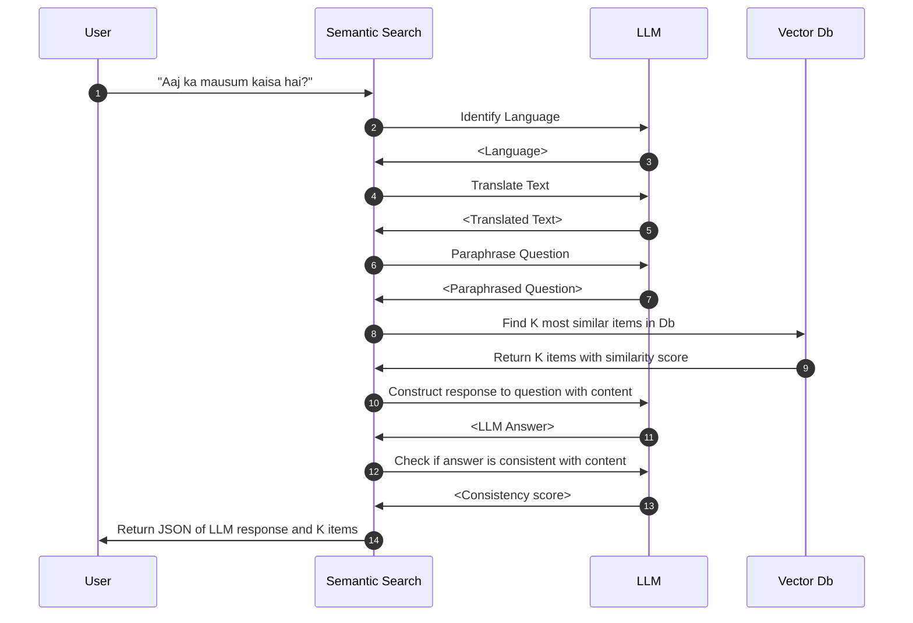

# LLM Response

This service returns uses most similar content in the database to construct a
custom answer for the user.

See OpenAPI specification or SwaggerUI for more details on how to call the service.

## Process flow

