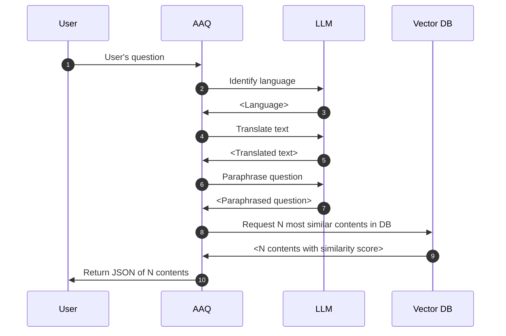

# Semantic Search

This service returns the contents from the database with the most similar vector
embeddings to the question. The content returned is exactly what is the database.

See OpenAPI specification or [SwaggerUI](index.md/#swaggerui) for more details on how to call the service.

## Process flow

