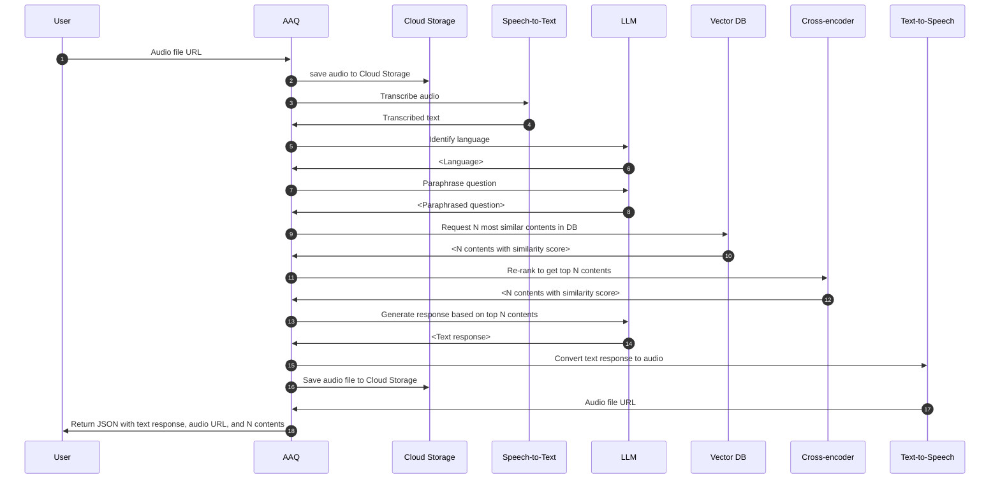

# Voice-Search

This service accepts an audio file URL, transcribes the speech to text, processes the query similar to the text-based search, and returns both a text response and an audio response URL.

See OpenAPI specification or [SwaggerUI](index.md/#swaggerui) for more details on how to call the service.

## Process flow for End to End Speech Generation

## Voice Service Integration

For detailed information on how to integrate voice capabilities into your application using AAQ, including setup instructions for both in-house and cloud-based speech services, please refer to our [Voice Service documentation](../voice-service/index.md). This documentation covers:

- Setting up the dockerized container for in-house ASR and TTS models
- Configuring Google Cloud Speech-to-Text and Text-to-Speech integration
- Best practices for voice input and output in your application

[:octicons-arrow-right-24: Explore Voice Service Documentation](../voice-service/index.md)
