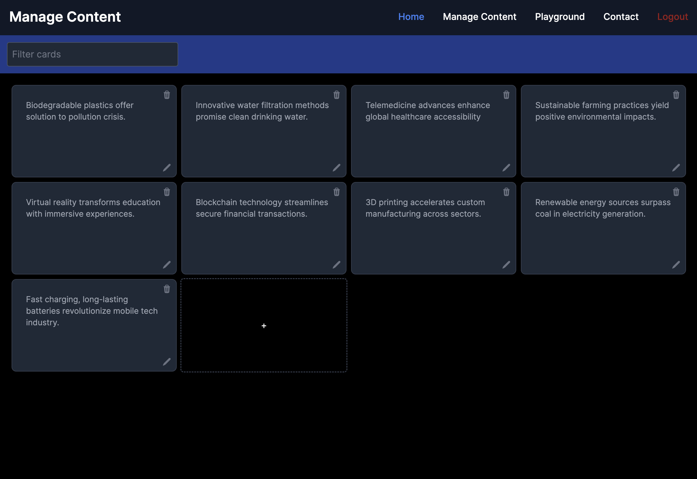

# Using the admin app

You can use the admin app to create new content, edit or delete an existing one.
If you have the [application running](../index.md#quick_start), you can access the admin app at:

    http://localhost:3000/

This should show you the following screen

{ align=left }
