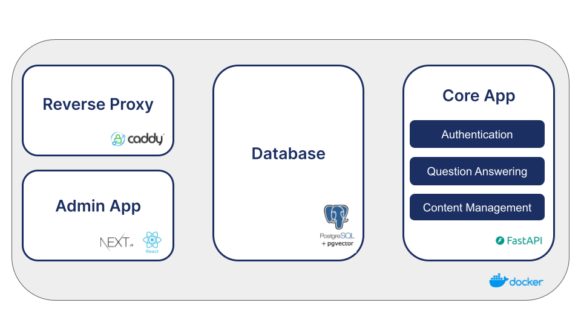
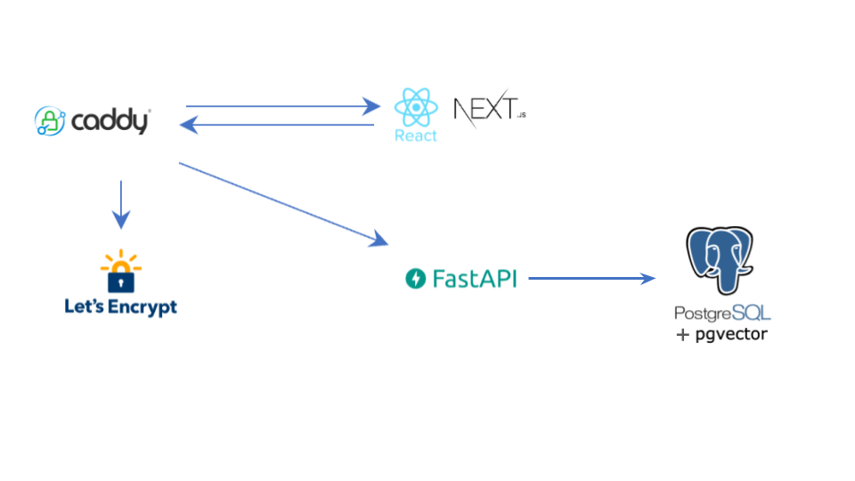

## Architecture

We use docker-compose to orchestrate containers.

  

A reverse proxy manages all incoming traffic to the service. The vector database and SQL database are only accessed by the core app.

  

