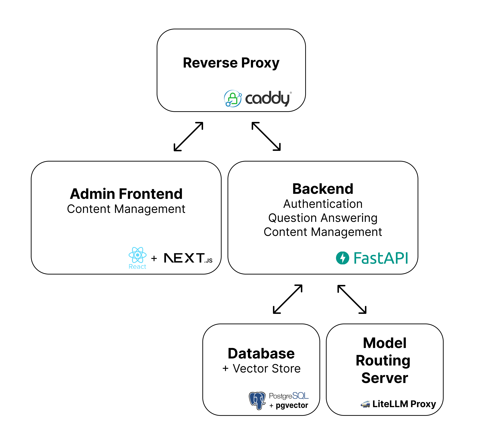

# Architecture

We use docker-compose to orchestrate containers with a reverse proxy that manages all incoming traffic to the service. The database and LiteLLM proxy are only accessed by the core app.

  

