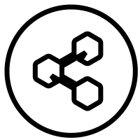

# { width="23" } Botpress v12   Setup Instructions

Below is an example of how to get Botpress v12 (OSS) running and connected to AAQ endpoints using a provided demo flow.

Note: [Botpress v12](https://github.com/botpress/v12/) is open-source and available to self-host but [Botpress Cloud](https://botpress.com/) is a different closed-source product.

## Demo AAQ flow

1. Once you have deployed Botpress v12 as per your requirements, go to the URL where the app is running
2. Make an account and login
3. Go to "Create Bot" and then "Import Existing" (you can set Bot ID to anything you want)
4. Load the `.tgz` file given under `chat_managers/botpress_v12/` in the [AAQ repo](https://github.com/IDinsight/ask-a-question/tree/main/chat_managers/botpress_v12)
5. Edit the "API Call" cards to reflect the AAQ endpoint URL that you have running *

    a. Click on the card

    b. Click on "Edit skill"

    c. Change the base of the URL at the top

    d. If you've changed the bearer token for the QA endpoints, you'll have to update the headers sections too

6. Test the bot in the emulator

??? note "* Errors with using `localhost` on the API Call skill?"

    If you're having trouble with localhost AAQ calls, try forwarding traffic through `ngrok` and using that for deployment of AAQ.

    1. Install and configure ngrok

    2. Run `ngrok http https://localhost` to forward traffic

    3. In `deployment/.env` file, ensure you have

            NEXT_PUBLIC_BACKEND_URL=https://[NGROK URL]/api
            BACKEND_ROOT_PATH="/api"

    4. In `deployment/.env.nginx` file ensure you have

            DOMAIN=[NGROK URL]  # don't add https/http at the front

    5. Change the base of the API Call skill so it looks like:

            [NGROK URL]/api/search

## Self-hosted deployment

### Option 1 - Via Docker Compose (behind Caddy with HTTPS)

**Step 1:** Navigate to `chat_managers/botpress_v12/deployment/`

**Step 2:** Copy `template.env` to `.env` and edit it to set the variables

**Step 3:** Run docker compose

    docker compose -p botpress-stack up -d --build

You can now access Botpress at `https://[DOMAIN]/`

**Step 4:** Shutdown containers

    docker compose -p botpress-stack down

### Option 2 - Via Docker

To install through Docker (recommended), follow the official Botpress v12 docs [here](https://hub.docker.com/r/botpress/server). In short:

1. Get the image

        docker pull botpress/server

2. Run the image

        docker run -d --name=botpress -p 3000:3000 botpress/server

### Option 3 - Via executables

Follow the official docs [here](https://v12.botpress.com/) to set up Botpress v12 locally as per your OS.
