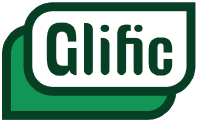
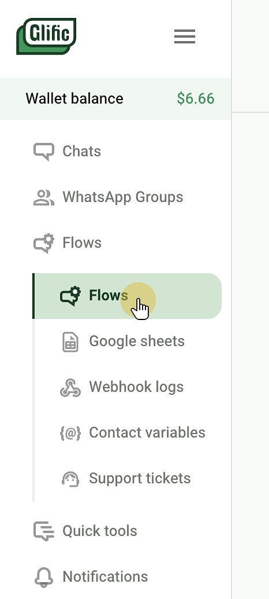
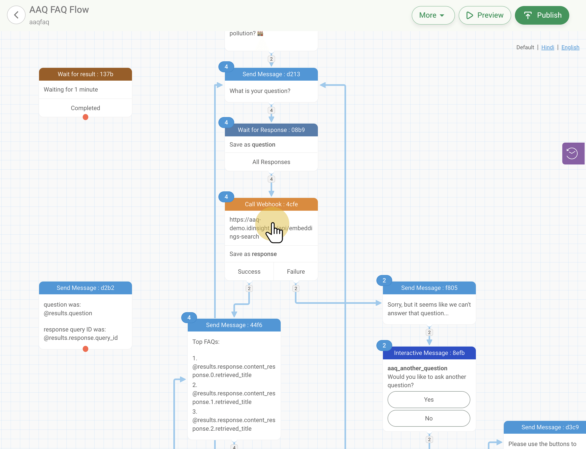
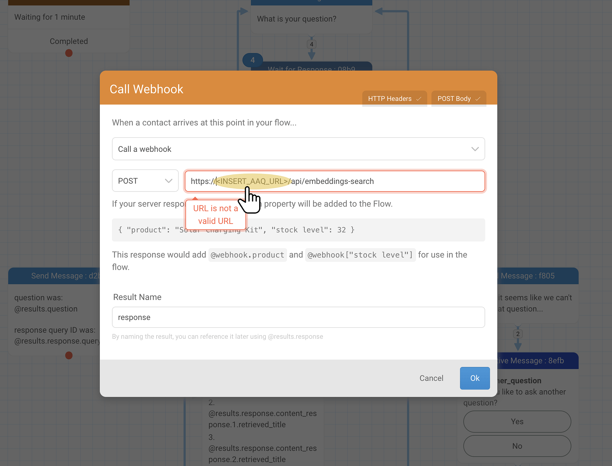
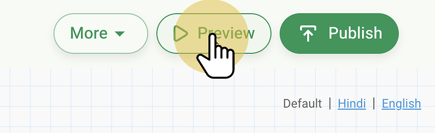
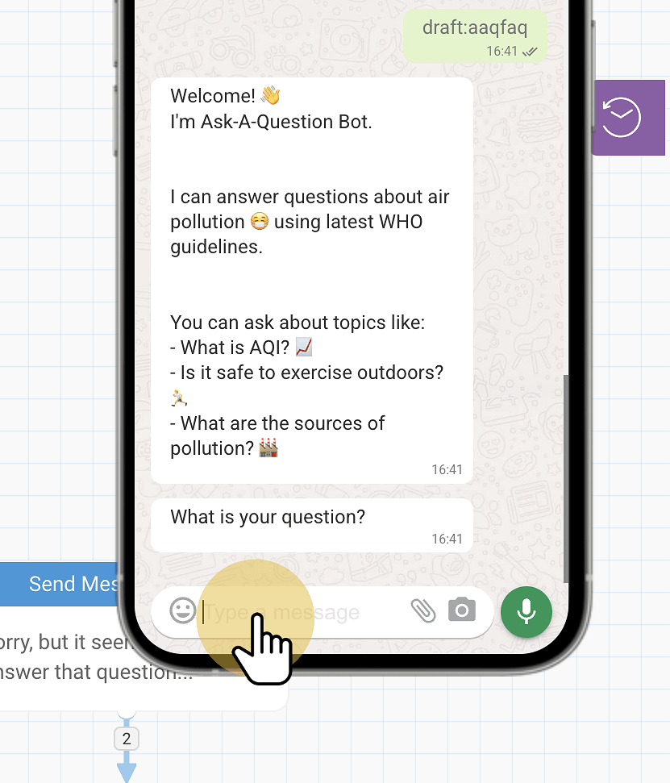

# { width="90" }   Setup Instructions

Below is a tutorial for how to load our FAQ template flow into Glific and connect it to your own AAQ endpoint.

1. Go to "Flows"

    { width="150" }

2. Click "Import flow"

    { width="400" }

3. Select a `.json` file given under `chat_managers/glific/` in the [AAQ repo](https://github.com/IDinsight/ask-a-question/tree/main/chat_managers/glific)

    { width="600" }

4. Open the imported flow

    { width="600" }

5. Open the webhook card

    { width="600" }

6. Replace `<INSERT_AAQ_URL>` with your the URL to your AAQ instance

    { width="600" }

7. Go to headers and replace `<INSERT_AAQ_API_KEY>` value to your own AAQ API key.

    { width="600" }
    { width="600" }

8. Test the flow in the "Preview" emulator

    { width="400" }
    { width="400" }
