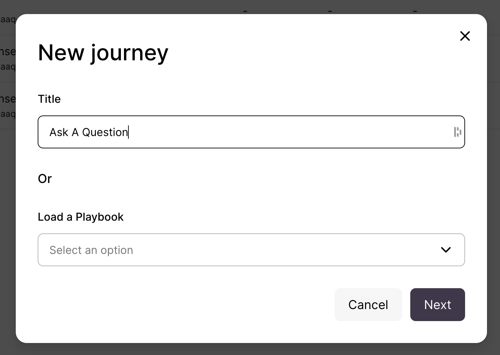
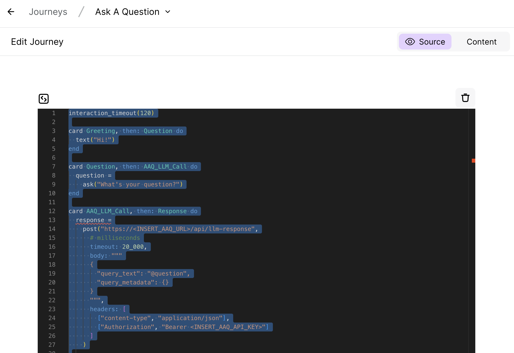

# { width="100" }   Setup Instructions

Below is an example of how to connect a [Turn.io Journey](https://whatsapp.turn.io/docs/build/journeys_overview) to AAQ endpoints.

1. On your [Turn.io](https://whatsapp.turn.io/app/) page, go to the Journey menu.

    { width="200" }

2. Create New Journey.

    { width="400" }

2. Select "From Scratch" -> "Code".

    { width="250" }

3. Type in your journey title and click "Next".

    { width=420 }

4. Copy and paste the contents of
   [chat_managers/turn.io/llm_response_flow_code_journey.txt](https://github.com/IDinsight/ask-a-question/blob/main/chat_managers/turn.io/llm_response_flow_code_journey.txt) in the AAQ repository into the
   Journey's code area.

    

5. Replace `<INSERT_AAQ_URL>` and `<INSERT_AAQ_API_KEY>` values to your own AAQ URL and
   API key.

    

6. Test the bot in the emulator.

    { width="300"}
