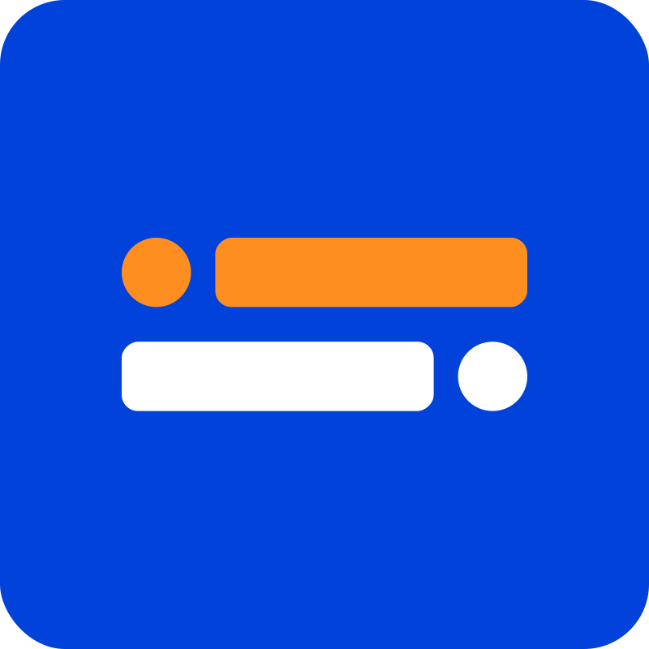

# { width="150" }   Setup Instructions

Below is a guide on how to connect to AAQ endpoints using a provided demo flow.

You can either use the cloud-hosted [Typebot](https://typebot.io/) service or self-host the application (see "Deployment" below).

## Demo AAQ flow

1. Go to your Typebot instance
2. Make an account and login
3. Go to "Create a typebot" and then "Import a file"
4. Load the `.json` file given under `chat_managers/typebot/` in the [AAQ repo](https://github.com/IDinsight/ask-a-question/tree/main/chat_managers/typebot)
5. Edit the "API Call" cards to reflect the AAQ endpoint URL that you have running

    a. Click on the card
    b. Change the base of the URL at the top
    c. Add the bearer token in the Headers section.

6. Test the bot in the emulator

## Deployment

For self-hosting, you can either follow the [official docs](https://docs.typebot.io/self-hosting/get-started)
or follow our quick start below:

**Step 1:** Navigate to `chat_managers/typebot/deployment/`

**Step 2:** Copy `template.env` to `.env` and edit it to set the variables

??? note "You must configure at least one login option while setting the environment variables."
    We recommend either Github or Google authentication. See Typebot's
    [docs](https://docs.typebot.io/self-hosting/configuration) for details.

**Step 3:** Run docker compose

    docker compose -p typebot-stack up -d --build

You can now access Typebot at `https://[DOMAIN]/`

**Step 4:** Shutdown containers

    docker compose -p typebot-stack down
